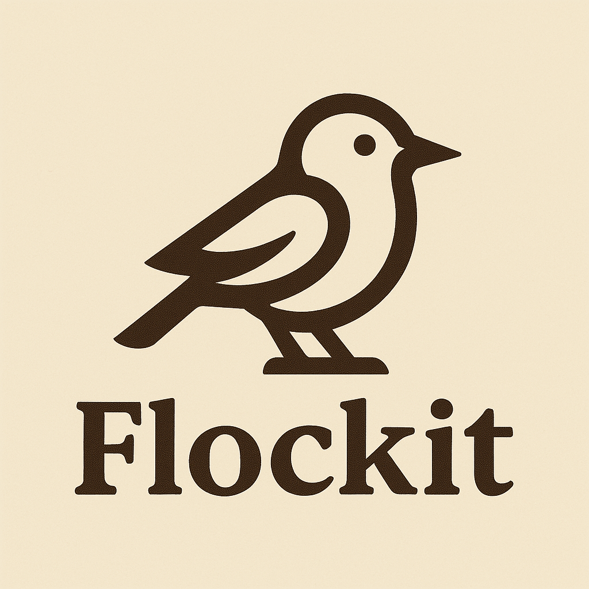

# 🧰 Flock-It: Integrated Pentest Framework



Flock-It is an all-in-one pentest automation framework designed to streamline the recon, scanning, and reporting process for internal, external, and web application testing. It supports plugin-based extensibility and AI integration for enhanced remediation and vulnerability context.

---

## 🤔 Why Flockit?

- Bird-Themed Modules: PreFlight checks, RavenRecon, and Owl reporting—each inspired by speed, intelligence, and vision.
- From Boot to Report: Designed for real-world pentesters to get from scope file to upload in minutes.
- Smart, Not Noisy: Flockit doesn't just scan—it organises, interprets, and documents.
- Built for Teams: Project folder structure and plugin architecture make it easy to hand off or scale.
- Modular as Flock: Swap in custom plugins, use XML/Markdown outputs, or integrate into your own workflow.
---

## 🚀 Features

- 🧪 Internal, external, and web recon support
- 🔌 Plugin-based architecture
- Includes built-in plugins for HTTP, FTP, SSH and SMB
- 🪄 Auto-generates custom plugins using LLM (Ollama)
- 🧠 AI-enhanced reporting and remediation context
- 📦 Auto SMB uploads to shared drives
- 🗂️ Structured scan and report directories per project
- 🖼️ ASCII network visualization
- 🔍 Scope-based scanning via `scope.txt`

---

## 🗂️ Example Project Output Structure

```
PR00099/
├── int_scope.txt
├── ext_scope.txt
├── web_scope.txt
├── summary.txt
├── scan_results.xml
├── report.md
├── Screenshots/
└── Scan-Data/
    └── 192.168.8.1/
        ├── banner_22.txt
        ├── http_80_output.json
        ├── ssh_22_output.json
        ├── nmap.csv
        └── ...
```

---

## 🧩 Module Breakdown

### 🛫 Preflight (pre-checks)
- Validates the project directory and structure
- Extracts and formats `scope.txt` into internal/external/web files
- Performs quick port reachability checks
- Tags valid IPs for further analysis

### 🦅 Raven (Active Scanning)
- Orchestrates live scans using `nmap`
- Automatically grabs banners
- Invokes loaded plugins per port
- Stores all plugin output in `Scan-Data/<host>/`

### 🐦 Magpie (Plugin Manager)
- Manages registration and loading of static and AI-generated plugins
- Supports autoloading from `modules/plugins`
- Registers plugins using `.should_run()` matching logic
### 📦 Built-in Plugins
- `http_scan` - grabs HTTP banner
- `ftp_scan` - captures FTP welcome message
- `ssh_scan` - collects SSH server banner
- `smb_scan` - lists SMB shares anonymously


### 🦉 Owl (AI Reporting & Summary)
- Creates a rich markdown report (`report.md`)
- Embeds host summaries, open ports, plugin results
- Collapsible vulnerability insights using markdown `<details>`
- Optionally opens the report automatically post-run

---

## 🪄 AI Plugin Generation

Flock-It integrates with **Ollama** to auto-generate service-specific scan plugins:

- Triggered when a new service/port combo is found
- Creates plugin file like `ai-gen-http_80_scan.py`
- Plugin class inherits `ScanPlugin`, uses `print_status`, and returns dictionaries
- Output is automatically saved under `Scan-Data/<host>/`

Plugins follow a structure like:
```python
from modules.plugins import ScanPlugin
from utils.common import print_status

class Http_80Scan(ScanPlugin):
    name = "http_80"

    def should_run(self, host, port, port_data):
        return port == 80

    def run(self, host, port, port_data):
        print_status("Running HTTP scan...", "info")
        return {"banner": port_data.get("banner", "N/A")}
```

---

## 🔧 Usage

```bash
python3 flockit_dev_0.6.py --project PR00100 --ascii --auto
```

Available flags:
- `--project <name>`: Project folder name (required)
- `--settings <file>`: Path to a custom settings XML file
- `--ascii`: Show ASCII network map
- `--output <file>`: Output report file (default: `report.md`)
- `--mode <quick|full>`: Select scan depth mode (default: `quick`)

### 🧠 Automation Flags
- `--auto`: Auto-accept all prompts (overrides others)
- `--auto-upload`: Automatically upload the zipped project folder to SMB
- `--auto-ai`: Automatically run AI vulnerability analysis after scan
- `--auto-view-report`: Automatically open the final markdown report
- `--auto-plugin`: Automatically generate AI-based plugins if not found
- `--project <name>`: Project folder name (required)
- `--auto`: Enable auto mode (preflight + scan + report)
- `--int`, `--ext`, `--web`: Limit scan type manually

---

## Demo


## 📦 SMB Upload Support

Flock-It can automatically zip the entire project directory and upload to an SMB share at the end of the run.

Target path is:
```
smb://<IP>/Media/Projects/<project_name>/<project_name>.zip
```
You’ll be prompted to enter credentials.

---

## 📋 Requirements

- Python 3.8+
- nmap (CLI)
- [Ollama](https://ollama.com/) (running locally)
- Impacket (for SMB uploads)

Install dependencies:
```bash
pip install -r requirements.txt
```

---

## 🤝 Contributions

Pull requests welcome. All AI plugin templates are being refined — contributions to prompt engineering or service detection logic especially helpful.

---

## 🧪 In Progress
- Report export to PDF/HTML
- Plugin classification by scan type
- Tag-based plugin enable/disable
- Cross-host correlation insights
- Passive recon integration

---

Happy flocking 🐦